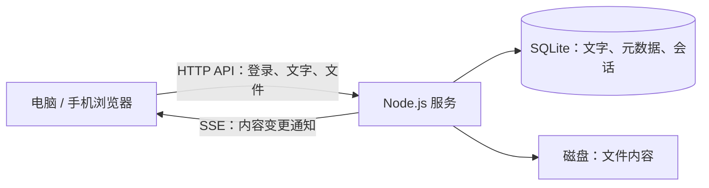

# ClipBridge

把文字和文件，送到自己的另一台设备。

ClipBridge（界面名称 **Jianuo Clip**）是一个轻量、自托管的跨设备剪贴板和文件中转工具。在电脑上发送文字或文件，再从手机、平板或另一台电脑的浏览器打开、复制或下载。内容保存在你运行服务的机器上。

后端使用 **Node.js 24 + SQLite**，前端使用原生 HTML、CSS 和 JavaScript，**没有第三方运行时依赖，也不需要前端构建**。适合个人和少量可信设备共用一个账号。

[快速开始](#快速开始) · [公网部署](docs/deployment.md) · [安全模型](SECURITY.md)

## 功能

- **文字共享**：发送、复制、删除，支持 `Ctrl/Cmd + Enter` 发送。
- **文件中转**：多文件选择与拖放、上传进度、附件下载，支持单区间 HTTP Range 下载。
- **实时更新**：通过 Server-Sent Events（SSE）通知在线设备，重新连接后补取最新列表。
- **持久化与清理**：SQLite 保存内容和元数据，文件独立落盘；按保留时间过期，限制单文件大小和文件总配额。
- **账号保护**：scrypt 密码验证、登录限速、会话 Cookie、同源写入校验及安全响应头；修改账号或密码并重启会撤销旧会话。
- **移动端界面**：响应式布局，提供 Web App Manifest 和 Service Worker 应用外壳缓存。
- **部署模板**：包含 Docker、Caddy、WireGuard 与 HAProxy 配置，以及自动化回归测试。

浏览器需要你主动发送和复制文字，页面不会在后台静默读取或改写系统剪贴板。文件上传不支持断点续传；Range 支持的是下载。

## 工作方式



文字以 UTF-8 字节数计量；文件流式写入临时目录，完成后移入文件目录并登记到数据库。活跃上传也会占用文件配额。内容到期后，API 立即停止返回该内容；磁盘清理在启动时及之后每 15 分钟执行，并回收中断上传和孤立文件。

仓库还提供“公网服务器做入口，家中电脑保存数据”的部署方式：

```text
浏览器 ── HTTPS ──> 公网 HAProxy（TCP 转发）
                           │
                      WireGuard 隧道
                           │
                           ▼
                   家中 Caddy（TLS 终止）
                           │ HTTP，仅容器内网
                           ▼
                   ClipBridge + SQLite + 文件
```

正常配置下，中转服务器不解密 HTTPS 业务内容，但仍可观察连接和流量信息。这不是客户端之间的端到端加密：家中服务可以读取内容，控制公网入口或证书验证链路的攻击者也不在此设计的完整防护范围内。详见 [安全模型](SECURITY.md)。

## 快速开始

需要 [Node.js 24 或更新版本](https://nodejs.org/)。以下流程用于在本机体验，不需要 Docker 或公网服务器。

```bash
git clone https://github.com/JianuoZhu/ClipBridge.git
cd ClipBridge
```

1. 复制配置文件：Linux/macOS 执行 `cp .env.example .env`；Windows PowerShell 执行 `Copy-Item .env.example .env`。
2. 生成一个随机密码：

   ```bash
   node -e "console.log(require('node:crypto').randomBytes(24).toString('base64url'))"
   ```

3. 编辑 `.env`，将域名改为 `localhost`、填入刚生成的密码，并添加本地 HTTP 设置：

   ```dotenv
   CLIP_DOMAIN=localhost
   CLIP_USERNAME=admin
   CLIP_PASSWORD=填入刚生成的随机密码
   CLIP_COOKIE_SECURE=false
   CLIP_DATA_DIR=./data
   CLIP_PORT=8080
   ```

4. 启动：

   ```bash
   npm start
   ```

打开 [http://localhost:8080](http://localhost:8080)，使用配置中的账号和密码登录。`npm start`、`npm run dev` 会自动读取根目录的 `.env`，已有进程环境变量优先。项目目前没有需要安装的依赖，可以直接运行。

本地服务监听 `0.0.0.0`；`CLIP_DOMAIN` 校验 Host，不代替网络访问控制。`CLIP_COOKIE_SECURE=false` 仅用于本机 HTTP 开发。跨设备部署请使用 HTTPS，保留安全 Cookie；[公网部署文档](docs/deployment.md) 包含完整步骤。

## 配置

`KB / MB / GB` 环境变量按 1024 进制计算，即 KiB / MiB / GiB。修改配置后需重启；Docker Compose 部署需重新创建容器。

| 变量 | 默认值 | 说明 |
| --- | --- | --- |
| `CLIP_PASSWORD` | 必填 | 12–1024 个字符，建议使用随机密码 |
| `CLIP_USERNAME` | `admin` | 共用账号名称，1–128 个字符 |
| `CLIP_DOMAIN` | 空 | 允许的主机名，不含协议、路径或端口；空值关闭 Host 校验。Compose 部署必填 |
| `CLIP_PORT` | `8080` | Node.js 监听端口；Compose 内固定使用 8080 |
| `CLIP_DATA_DIR` | `./data` | 数据目录；Compose 内为 `/data`，映射到宿主 `./data` |
| `CLIP_COOKIE_SECURE` | `true` | 安全 Cookie 开关；Compose 固定为 `true` |
| `CLIP_RETENTION_HOURS` | `24` | 新内容保留时间，1–8760 小时 |
| `CLIP_MAX_FILE_MB` | `512` | 单文件上限，1–10240 MiB |
| `CLIP_MAX_STORAGE_GB` | `5` | 有效文件及活跃上传配额，1–1024 GiB |
| `CLIP_MAX_TEXT_KB` | `1024` | 每条文字 UTF-8 大小上限，1–4096 KiB |
| `CLIP_SESSION_DAYS` | `30` | 新会话有效期，1–365 天 |
| `CLIP_TUNNEL_IP` | `10.66.0.2` | 仅用于 Compose 绑定家中 Caddy 的 80/443 端口 |

文件配额不等于磁盘总占用：SQLite、文字、待清理文件、日志和备份仍需要额外空间。修改保留时间或会话天数只影响之后创建的内容或会话。

## 数据、更新与备份

```text
data/
├── clip.db         # SQLite：文字、文件元数据、会话、凭据派生值
├── clip.db-wal     # 运行期间可能存在的 SQLite WAL 文件
├── clip.db-shm     # 运行期间可能存在的 SQLite 共享内存文件
├── blobs/          # 以随机 UUID 命名的已完成文件
└── uploads/        # 上传临时文件
```

请把整个数据目录视为私密数据。内容没有应用层静态加密，删除与到期清理也不等于安全擦除磁盘或备份。

Docker 部署的备份示例（在项目根目录执行）：

```bash
sudo docker compose down
sudo tar -czf "clip-backup-$(date +%Y%m%d-%H%M%S).tar.gz" data
sudo docker compose up -d
```

直接运行 Node.js 时，先用 `Ctrl+C` 停止应用，再备份整个 `data` 目录。不要运行中只复制 `clip.db`。恢复前停止应用，恢复完整目录并检查读写权限；Docker 使用 UID/GID `1000:1000`。`.env` 和 Caddy 证书卷需要另行安全备份。

取得更新后，直接运行方式重新执行 `npm start`，Docker 方式执行 `sudo docker compose up -d --build`。**首次升级到带凭据绑定的版本会要求所有设备重新登录，已保存内容保留。** 此后凭据不变的重启保留会话；修改用户名或密码并重启会撤销全部旧会话。

## 开发与验证

```bash
npm run dev    # 读取 .env，修改源码后自动重启
npm run check  # 检查所有应用 JavaScript 的语法
npm test       # Node.js 内置测试运行器，无额外测试依赖
```

测试覆盖登录与撤销、配置校验、文字和文件流程、配额与异常上传、Range 下载、SSE、数据库升级，以及前端会话竞态和 Service Worker 缓存边界。前端行为测试使用隔离的 DOM 模拟，不能代替真实浏览器兼容性测试；公网 TLS 与 WireGuard 链路需要部署后验证。

```text
src/                # 配置、认证、SQLite 存储、HTTP 服务与进程入口
web/                # 原生前端、样式、Manifest、Service Worker
tests/              # API、存储、认证和前端回归测试
infra/home/         # 家中 WireGuard 模板
infra/server/       # 公网 WireGuard 与 HAProxy 模板
docs/deployment.md  # 公网部署与排错
compose.yaml        # 家中 Node.js + Caddy
Dockerfile          # 非 root Node.js 镜像
Caddyfile           # HTTPS 入口配置
```

## 当前边界

- 单账户、单实例；不要让多个进程或容器共用一个数据目录。
- 最近列表最多显示 100 条未过期内容，暂不提供分页或搜索；旧文件仍占配额，直到删除或过期。
- 不支持设备配对、单设备撤销、多人权限、后台系统剪贴板同步或断点上传。
- Service Worker 仅缓存应用外壳，不缓存 API 数据、文字或下载文件；离线时不能同步，安装入口取决于浏览器支持。
- 家中电脑离线、睡眠或隧道中断时，公网部署不可用。

欢迎通过 Issue 提交问题，通过 Pull Request 提交改进。安全问题请按 [SECURITY.md](SECURITY.md) 私下报告，并避免公开真实凭据或私人内容。
