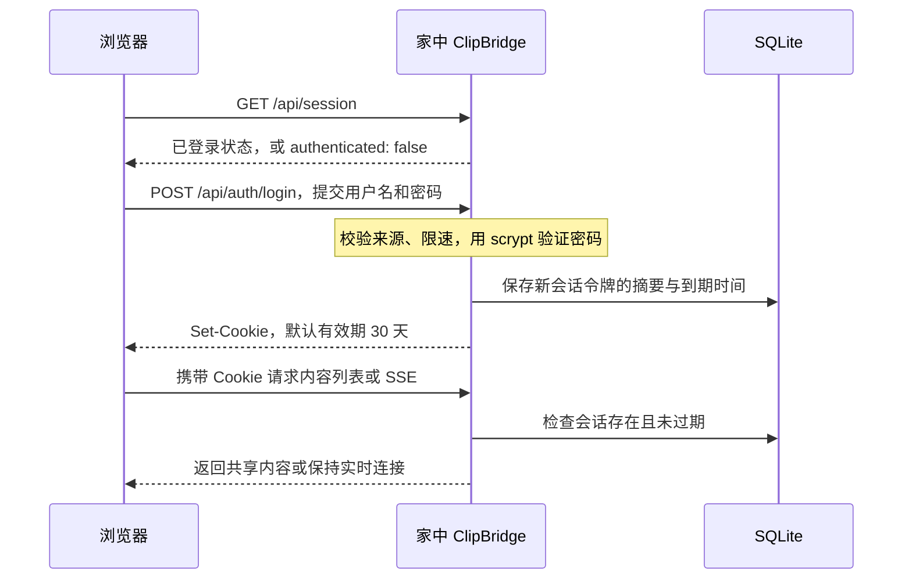

# 登录与账号机制

## 当前支持到什么程度

ClipBridge 提供**单个共享账号的身份验证与会话管理**，适合一个人自己的多台设备。它没有完整的多用户系统。

| 能力 | 当前行为 |
| --- | --- |
| 配置账号 | 部署者在家中节点配置一组用户名与密码 |
| 多设备登录 | 支持，每次登录创建独立会话 |
| 保存登录状态 | 支持，默认 30 天固定有效期，不因使用而自动续期 |
| 退出登录 | 撤销当前浏览器会话；同一浏览器共享该 Cookie 的页面一同退出 |
| 修改账号或密码 | 修改配置并重启，撤销全部旧会话 |
| 注册、找回密码 | 没有；部署者直接修改家中节点配置 |
| 多个独立账号 | 不支持 |
| 私有空间、角色、权限 | 不支持；登录设备共享全部内容和操作权限 |
| 设备列表、单设备撤销 | 没有管理界面 |

SQLite 的 `sessions` 表记录登录会话，`auth_credentials` 只保存一条配置账号的凭据派生状态。它们不是用户注册数据库；`items` 表也没有按用户归属区分内容。

## 为什么需要登录

公网地址上的网页可以被任何人访问。登录保护后面的文字、文件和删除操作：没有会话，访问者只能看到页面外壳和登录表单，不能读取内容列表、下载文件、上传或删除内容。健康检查接口也不包含私人内容。

HTTPS 解决传输中的加密，WireGuard 解决公网服务器与家中节点的隧道连接；这两者都不能回答“这个打开网页的人是否有权读取你的文件”。共享账号承担这个访问控制职责。

因此，不应把同一账号发给需要相互隔离数据的不同用户。知道这组凭据的人拥有同一内容空间的读取、上传和删除权限。

## 一次登录会发生什么



1. 应用启动时读取 `.env` 或进程环境中的配置账号。密码用随机盐和 scrypt 派生；数据库保存派生值，不保存明文密码。
2. 浏览器打开页面后先检查现有 Cookie。没有有效会话才显示登录表单。
3. 提交登录时，服务器检查请求标记、Origin、限速以及用户名和密码。
4. 验证成功后，生成随机会话令牌，把令牌摘要和有效期存入 SQLite，并通过 Cookie 把令牌交给浏览器。
5. 后续请求自动带上 Cookie，不需要每次输入密码。生产 Cookie 使用 `Secure`、`HttpOnly` 和 `SameSite=Strict`；前端脚本不能直接读取它。
6. 文字、文件、删除和实时连接都要验证会话；实时连接还会在通知和心跳时复查有效性。

密码只配置在家中节点。在正常的 TCP 转发部署下，公网 HAProxy 不验证应用账号，也不接收解密后的登录请求。更详细的威胁边界见 [SECURITY.md](../SECURITY.md)。

## 配置、退出与撤销

家中节点 `.env` 示例：

```dotenv
CLIP_USERNAME=admin
CLIP_PASSWORD=填写自己的随机密码
CLIP_SESSION_DAYS=30
```

用户名 `admin` 只是默认名称，没有额外的管理员角色。实际密码应使用随机生成值；修改后用以下命令重建应用容器：

```bash
sudo docker compose up -d --build
```

直接运行 Node.js 时，停止后重新 `npm start`。修改账号或密码会让全部旧会话失效；普通重启且凭据不变时，会话仍可继续使用。修改 `CLIP_SESSION_DAYS` 只改变新会话的时长。

点击页面“退出”撤销当前会话，关闭对应实时连接并清空页面中的内容。它不会删除服务器上的共享内容，也不会退出其他浏览器中独立创建的会话。要让全部设备重新登录，修改密码并重启。

首次升级到带凭据绑定的版本会撤销旧会话，内容仍保留。这是自动数据库升级的行为，无需清空数据库。

如果未来要提供真正的多用户服务，需要增加独立用户记录、会话与用户关联、内容所有权及接口权限检查，还需要设计账号创建、恢复和管理流程。当前界面的登录框并不代表这些能力已经存在。
